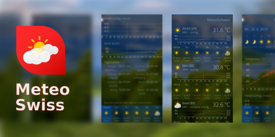

<!--
SPDX-FileCopyrightText: 2022 Mirian Margiani
SPDX-License-Identifier: GFDL-1.3-or-later
-->

# Swiss weather forecasts for Sailfish OS

<!--  -->
<!--  -->
<!--  -->
<!--  -->
<!--  -->

This is an unofficial client to the weather forecast services provided by the
Federal Office of Meteorology and Climatology (MeteoSwiss).

## Help and support

You are welcome to leave a comment on
[OpenRepos](https://openrepos.net/content/ichthyosaurus/meteoswiss) or
in the Jolla store.

## License

### Data and icons

> Copyright, Federal Office of Meteorology and Climatology MeteoSwiss.
>
> Weather icons by Zeix.
>
> https://www.meteoswiss.admin.ch/

### App

> Copyright (C) 2018-2022  Mirian Margiani

This app is Free Software released under the terms of the
[GNU General Public License v3 (or later)](https://spdx.org/licenses/GPL-3.0-or-later.html).
The source code is available [on Github](https://github.com/ichthyosaurus/harbour-meteoswiss).
All documentation is released under the terms of the
[GNU Free Documentation License v1.3 (or later)](https://spdx.org/licenses/GFDL-1.3-or-later.html).
